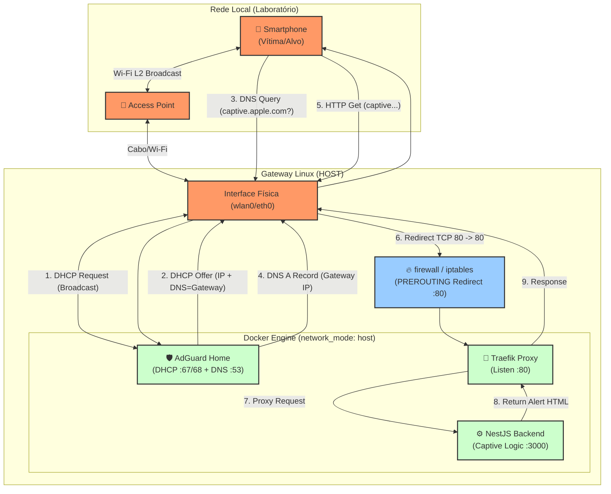

# Diagrama de Arquitetura - Simulação Alerta AMBER

## Descrição do Fluxo

1.  **Associação L2**: O Smartphone se conecta ao AP.
2.  **DHCP (Crítico)**: O AdGuard (rodando em mode:host) detecta o *DHCP Discover* e atribui um IP, definindo o **DNS Server** como o próprio Gateway IP.
3.  **Captive Check**: O SO do smartphone tenta acessar uma URL de verificação (ex: `captive.apple.com`).
4.  **DNS Poisoning**: O AdGuard responde com o IP do Gateway para qualquer domínio de teste.
5.  **Intercepção**: O tráfego HTTP porta 80 é capturado pelo `iptables` no Host e redirecionado para o Traefik.
6.  **Entrega do Alerta**: O NestJS responde com o HTML do Alerta para *qualquer* caminho solicitado, enganando o Captive Portal Helper do celular, que exibe a página como uma tela de login/sistema.
